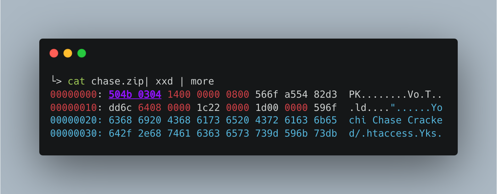

## Day 1 - File headers

Detecting file headers in YARA seem to be a useful thing when narrowing down types of files you want to analyze.

I am particularly interested in finding zipped archives on Virustotal hunt, maybe to find phishing kits. These kits are generally Zip archives that a threat actor leaves on phishing server. I've seen people download these files and upload them to Virustotal. 

[This](https://blog.korelogic.com/blog/2015/08/19/yara-ctf-2) was a useful blog for Zip file dissection using YARA.

I can check for the Zip file header at position 0 and cast it to `uint32`

`uint32(0) == 0x04034b50`

A sample Zip file has these headers, dump to xxd

Underlined/purple bytes in xxd show the Zip header

Let's make this more interesting though. Almost every phishing kit I've seen uses Php, so is there a way we can look for Php files, or an .htaccess file?

The interesting thing about zipfiles is that you can find the zip header delimiting separate files. For example, although `uint32(0)` above matches the zip header, this is all over the zip file. That's because there is a zip header delimiting each file, and you can get metadata from there!

To familiarize myself with the header, I did the following in python/bash to confirm file name length. I'd like to match on the file names for php files, .htaccess, etc

Success! So let's retrieve each Zip file header in an archive, go to the offset at byte 26 and retrieve the file name length, then from byte 30 to filenamme length get the file name string, and match on that

