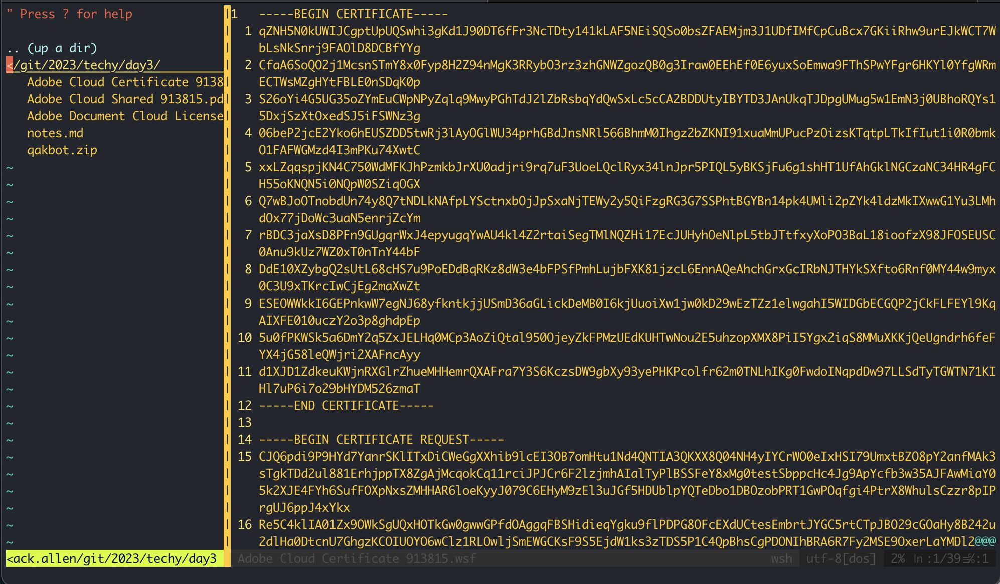

## Day 3 - Zip File headers - Qakbot

Qakbot is the bane of many security researcher's existence. They've recently graduated into delivering payloads via Windows WSF files. When [reading](https://en.wikipedia.org/wiki/Windows_Script_File) the Wiki, it sounds like a file format that threat actors drool over. You can mix all kinds of languages.. together? Perl? Vbscript? Yah go ahead!

I downloaded a Qakbot sample from VTI https://www.virustotal.com/gui/file/9981bf6ad64c2f48de970948b4dc6ca5e3e5f9ca8b86c2db921e032cd4a4c6cb that is a Zipfile. My hope is there is a WSF file in there. I'll write a Yara rule and copy my previous days' rules. 

```bash
└> unzip -l qakbot.zip
Archive:  qakbot.zip
  Length      Date    Time    Name
---------  ---------- -----   ----
     7779  02-14-2023 06:38   Adobe Cloud Certificate 913815.wsf
   309944  02-14-2023 06:38   Adobe Cloud Shared 913815.pdf
     9071  02-14-2023 06:38   Adobe Document Cloud License.txt
---------                     -------
   326794                     3 files
```

Since `wsf` files are just XML, I opened up `vim` and got confused. Wtf? Where's the code?



Turns out the Qakbot operators embedded `jscript` inside a certificate file. Valid WSF I guess? Might be a low value rule, but it detects `wsf` file extensions inside a Zip file


### Things I learned
* WSF files on Windows can have VBScript or JScript, and are executable!
* Underlying Windows APIs are made available via WSF scripting engine, making it attractive for threat actors